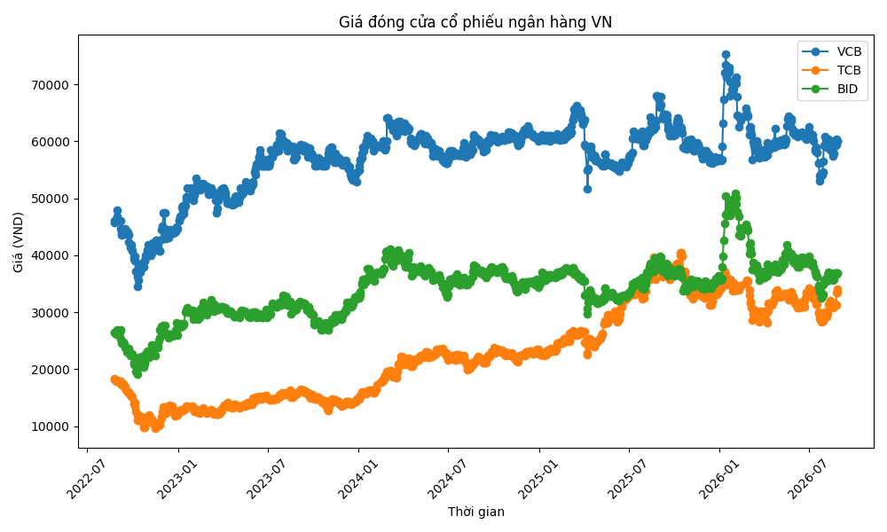
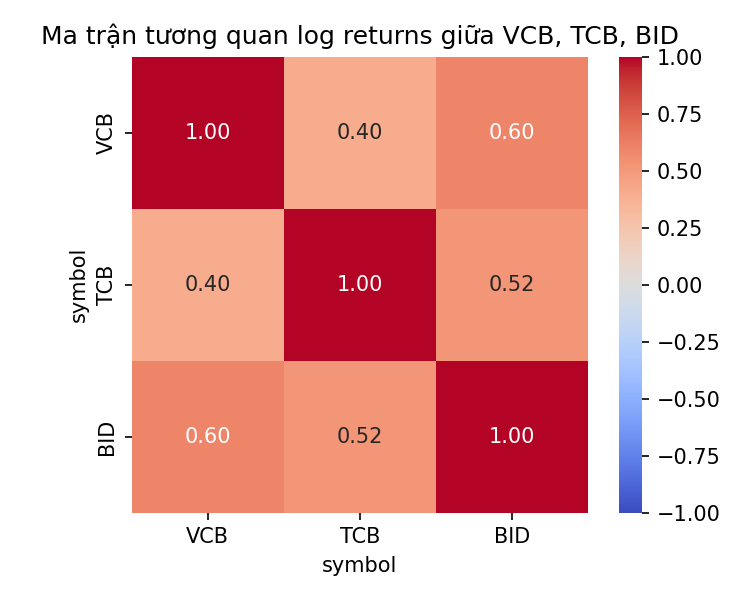
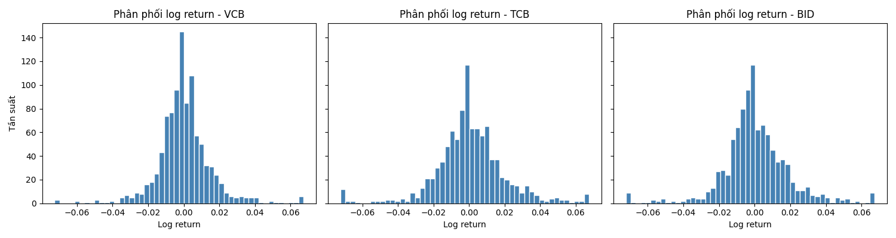

# vn-banking-stocks-analysis
Analysis of stock price trends for 3 listed Vietnamese banks (VCB, TCB, BID), 2022-2026, using Python.

## Data
Historical daily closing prices for VCB, TCB, BID (2022-2026), sourced from Simplize.

## Findings 
- **Returns & risks (2022-2026)**: TCB has the highest average annual return of the 3 codes (~15.18%/year), but also comes with the highest volatility (~32.13%/year). VCB has the lowest profit (~6.90%/year) but is much more stable (volatility ~24.22%/year, the lowest of the 3 codes). BID is average for both indexes (~8.44%/year return, ~30.25%/year volatility). 
- **Sharpe ratio**: TCB has the best profit/risk ratio (Sharpe ≈ 0.32), outperforming BID (≈0.11) and VCB (≈0.08) — although VCB is the most stable in terms of volatility, the low profit level makes VCB's risk compensation ratio the least attractive during the survey period.
- **Correlation**: The correlation coefficient between the 3 codes ranges from 0.40 (TCB-VCB) to 0.60 (VCB-BID), at an average to quite high level. This reflects the general systemic risk of the banking industry - holding all three codes at the same time does not help reduce risk as much as expected, because most of the fluctuations come from general macro factors (interest rate policy, industry-wide credit growth) and not just from the specific characteristics of each bank.
- **Strong fluctuations in early 2026**: All 3 codes recorded many sessions of strong fluctuations (returns exceeding the threshold of 2 standard deviations) focusing on early January and early-mid April 2026. The first period of April coincided with the season of the General Meeting of Shareholders (AGM) of the banking industry - VCB alone increased to the ceiling on April 23, 2026 right before the General Meeting of Shareholders announced a plan to increase charter capital from ~83,557 billion to ~94,000 billion VND through issuing more than 1.06 billion new shares.
- **TCB had two notable volatile sessions on August 10 and August 26, 2026**, coinciding with the time when banks announced their reviewed financial statements for the first 6 months of 2026 and near the milestone when FTSE Russell officially announced the upgrade of Vietnam's market to emerging market (August 21, 2026) - although TCB is not in the basket of 8 banking codes directly included in the FTSE index, this fluctuation may reflect the effect spread across the entire industry group. This is also consistent with the fact that TCB has the highest volatility among the three codes - more sensitive to market information.
- **The first period of January 2026** (VCB and BID both increased continuously in many sessions from January 7-15): coincides with the market's general expectation of a new growth cycle for banking stocks in 2026, when cash flow is forecast to return to this group after the period of differentiation at the end of 2025.

## Limitations
- On July 20, 2026, all 3 codes decreased sharply (-3% to -5%) but the specific cause has not been determined - it may be a general market adjustment, requiring further research.
- The explanation of the cause of fluctuations is based on time comparison between price data and public news, which is correlation, not statistically tested evidence of cause and effect.
- Price data is adjusted close, excluding the effect of dividends/stock splits — the odd decimals in the data reflect this characteristic.
- The risk-free rate used to calculate the Sharpe ratio is a simple assumption (~5%/year), not using the appropriate term government bond interest rate at each time - if you need to be more precise, you can replace it with the actual 1-year government bond interest rate.
- Correlation analysis is only based on daily returns over the entire period, not testing the stability of correlation across different market periods (rolling correlation) — the correlation coefficient may change during periods of strong market fluctuations compared to stable periods.
## Tools
Python (pandas, matplotlib) on Google Colab

## Challenges
Initially, I planned to fetch stock data automatically using the vnstock Python library. However, I ran into two issues: the VCI data source blocks requests from Google Cloud IP addresses (where Colab runs), and other sources in the library returned inconsistent or unsupported errors. After several failed attempts with different data sources, I switched to manually exporting historical price data from a financial data website and uploading it as a file, which proved to be more reliable for this project's scope. This taught me that in real-world data work, the "clean" automated solution isn't always available, and adaptability to a working alternative matters more than sticking to the original plan.
