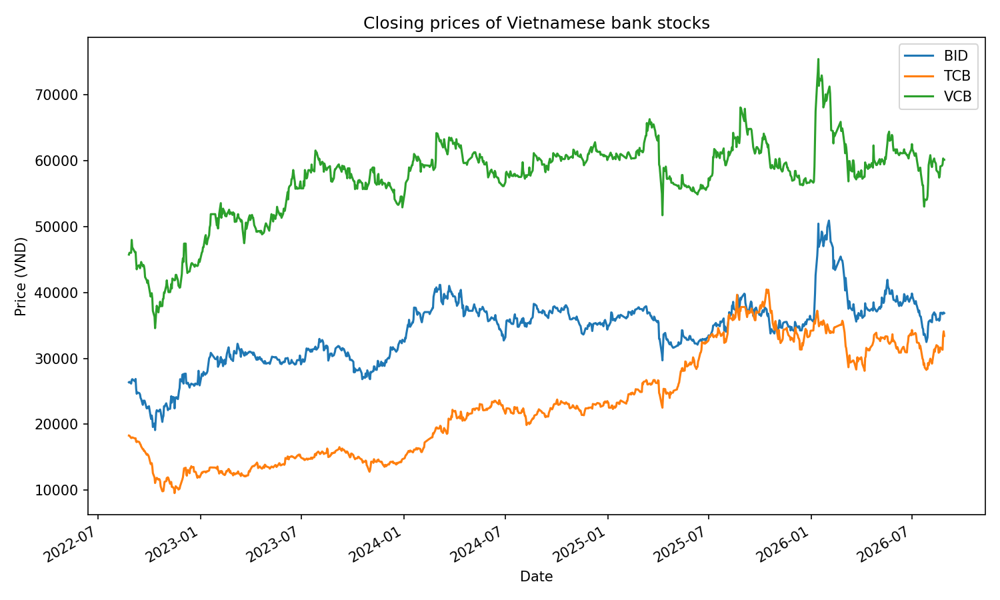
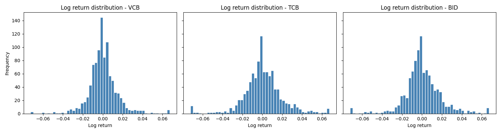
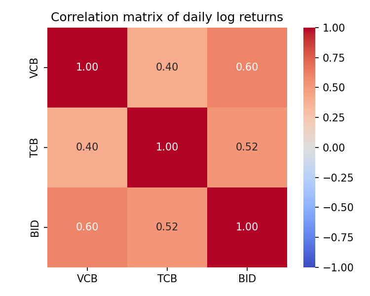
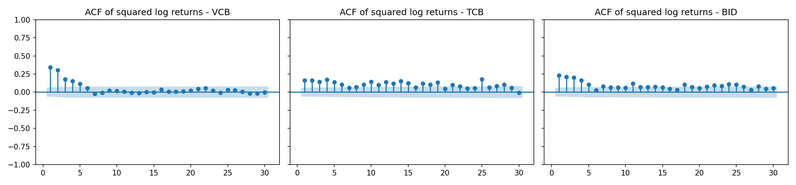

## VN Banking Stocks Analysis

Quantitative analysis of return, risk, and correlation for three listed Vietnamese banks — VCB, TCB, and BID — using daily price data from August 2022 to August 2026.

### Objective

Bank stocks are often assumed to move together given their shared exposure to interest rate and monetary policy cycles. This project tests that assumption quantitatively: how do VCB, TCB, and BID compare in terms of return, volatility, and risk-adjusted performance, and how closely correlated are their price movements? It also examines the statistical properties of the returns (fat tails, price-limit effects, volatility clustering) and how robust the risk-adjusted comparison is.

### Data

Historical daily OHLC price data for VCB, TCB, BID (25 Aug 2022 – 28 Aug 2026, about 1,000 trading days per stock), exported manually from Simplize. In line with Simplize's terms of use, the raw data files are not redistributed in this repository (see `data/README.md`). Prices were cleaned, converted to proper datetime format, and pivoted into a single time-indexed table for analysis. Prices are used as provided by the source; older prices appear to be adjusted for corporate actions (non-round values), but the adjustment method was not independently verified. Dividends and transaction costs are not modeled.



### Methodology

- **Log returns** — computed daily log returns for each stock (ln(P_t / P_t-1)), the standard approach in quantitative finance for return aggregation and volatility estimation.
- **Return distribution** — plotted the distribution of daily log returns for each stock, and computed skewness, excess kurtosis and the Jarque–Bera normality test.

  

- **Volatility** — calculated daily and annualized volatility (standard deviation of log returns, annualized with √252).
- **Risk-adjusted return** — calculated annualized return (mean daily log return × 252) and Sharpe ratio for each stock. The risk-free rate is assumed at 5% annually as a simplified proxy for 12-month deposit rates at large Vietnamese banks (counter rates are currently around 5.9%). 95% confidence intervals were computed with a bootstrap over trading days (5,000 resamples), and results were checked for sensitivity to the start date and to the risk-free rate (3%–7%).
- **Correlation** — computed the pairwise correlation matrix of daily log returns across the three stocks.
- **Volatility clustering tests** — Ljung–Box and ARCH-LM tests and ACF plots on squared log returns.
- **Anomaly detection** — flagged trading sessions in 2026 where absolute daily return exceeded 2 standard deviations (full-sample), to identify unusually volatile sessions.

### Key Findings

**Risk and return (annualized, Aug 2022 – Aug 2026):**

| Stock | Annualized Return | Annualized Volatility | Sharpe Ratio | 95% CI (bootstrap) |
|---|---|---|---|---|
| VCB | 6.90% | 24.22% | 0.078 | [−0.90, 1.03] |
| TCB | 15.18% | 32.13% | 0.317 | [−0.69, 1.28] |
| BID | 8.44% | 30.25% | 0.114 | [−0.86, 1.05] |

TCB delivered the highest return and the highest volatility, and has the best point-estimate Sharpe ratio. VCB was the most stable (lowest volatility) but also the lowest-returning, which may reflect its larger and more established profile. However, the Sharpe ratios are estimated with wide uncertainty: the bootstrap 95% CI of the TCB–VCB difference is [−0.87, 1.31], which includes zero, so the ranking is **not statistically distinguishable** over this 4-year sample. The point-estimate ordering (TCB > BID > VCB) is stable across risk-free rates of 3%–7% and across start dates, but the levels are sensitive to the sample window (for example, from 2023-01-01 the Sharpe ratios are TCB 0.81, BID 0.17, VCB 0.14).

**Return distributions:** daily returns are heavy-tailed and reject normality for all three stocks (Jarque–Bera p < 0.001).

| Stock | Skewness | Excess kurtosis | Sessions with \|return\| ≥ 6.5% |
|---|---|---|---|
| VCB | 0.25 | 4.75 | 9 |
| TCB | −0.18 | 2.69 | 24 |
| BID | −0.06 | 3.15 | 19 |

The spikes near −0.07 and +0.07 in the TCB and BID histograms coincide with sessions at the daily price limit of ±7% on HOSE (log-return equivalents of about +0.068 and −0.073), so returns are effectively truncated at those bounds.

**Correlation of daily returns:**

| | VCB | TCB | BID |
|---|---|---|---|
| VCB | 1.00 | 0.40 | 0.60 |
| TCB | 0.40 | 1.00 | 0.52 |
| BID | 0.60 | 0.52 | 1.00 |



All three pairs are positively correlated, confirming that Vietnamese bank stocks tend to move together — possibly reflecting shared sensitivity to sector-wide factors such as interest rate policy and credit growth. VCB and BID show the strongest co-movement (0.60), while VCB and TCB are the most loosely linked (0.40), suggesting TCB's price behavior is somewhat more idiosyncratic than the other two. These are full-sample correlations and may vary over time.

**Volatility clustering:** Ljung–Box and ARCH-LM tests on squared log returns reject the null of no ARCH effects for all three stocks (p < 0.001), so volatility is clearly time-varying. The ACF of squared returns shows a shorter-lived effect for VCB (significant up to roughly lag 6) and a more persistent one for TCB and BID (positive across most of the 30 lags shown). This persistence may partly reflect regime shifts, such as the late-2022 sell-off and the early-2026 spike, rather than GARCH-type dynamics alone.



**2026 anomalies:** 13.0% / 4.3% / 9.3% of 2026 sessions for VCB / TCB / BID exceeded 2 standard deviations (vs. roughly 5% expected under a normal distribution), so the early-2026 turbulence was concentrated in VCB and BID rather than TCB. Four sessions (2026-03-02, 03-09, 04-08, 07-20) were flagged for all three stocks, and the largest moves cluster in the second week of January 2026, consistent with the sharp price spike visible in the price chart. The macro or sector-specific drivers of this window remain to be investigated.

### Limitations

- Three stocks and about four years of daily data; results do not generalize to the whole banking sector.
- Sharpe ratios are estimated with wide uncertainty (see CIs) and are sensitive to the start date. The bootstrap resamples days independently, which ignores the volatility clustering found above, so the intervals may be somewhat too narrow rather than too wide.
- A constant risk-free rate is assumed although actual rates varied over 2022–2026.
- Dividends and transaction costs are not modeled.
- Because the raw data cannot be redistributed, the results can only be reproduced after exporting the data from the source; later exports may differ if the source revises adjusted prices.

### Tools

Python (pandas, numpy, matplotlib, seaborn, scipy, statsmodels) on Google Colab.

### Challenges

Initially, I planned to fetch stock data automatically using the vnstock Python library. However, I ran into two issues: the VCI data source blocks requests from Google Cloud IP addresses (where Colab runs), and other sources in the library returned inconsistent or unsupported errors. After several failed attempts with different data sources, I switched to manually exporting historical price data from a financial data website and uploading it as a file, which proved to be more reliable for this project's scope. This taught me that in real-world data work, the "clean" automated solution isn't always available, and adaptability to a working alternative matters more than sticking to the original plan.

### Future Work

- Model conditional volatility with GARCH(1,1) and asymmetric variants (e.g., GJR-GARCH), given the ARCH effects found here
- Benchmark against VN-Index and extend the comparison to a broader set of listed Vietnamese banks
- Rolling correlation and rolling volatility to study how co-movement changes in stress periods
- Investigate the macro/news drivers behind the early-2026 volatility spike identified in the anomaly detection step

### How to Run

Open `vn_banking_stocks_analysis.ipynb` in Google Colab or Jupyter.

Required libraries: `pandas`, `numpy`, `matplotlib`, `seaborn`, `scipy`, `statsmodels`, `openpyxl` (see `requirements.txt`; install with `pip install -r requirements.txt`).

**Raw price data files**

The raw data is not included in this repository (Simplize terms of use). Export the daily price history for VCB, TCB and BID from Simplize and save the files as:

```
data/VCB_history.csv.xlsx
data/TCB_history.csv.xlsx
data/BID_history.csv.xlsx
```

In Google Colab, the first cell of the notebook prompts you to upload these files. When running locally, place them in the `data/` folder before running the notebook. See `data/README.md` for details.
